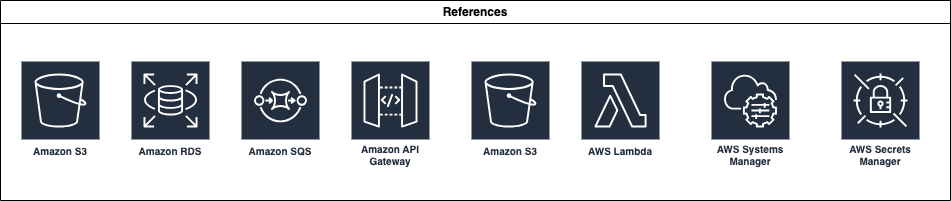
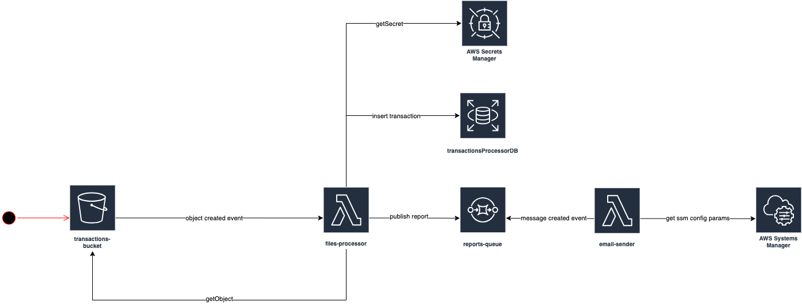
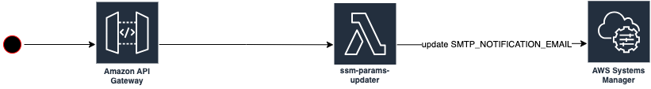
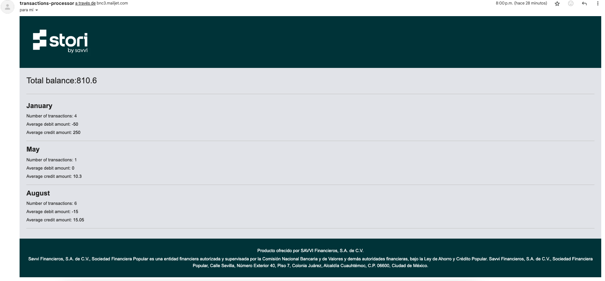
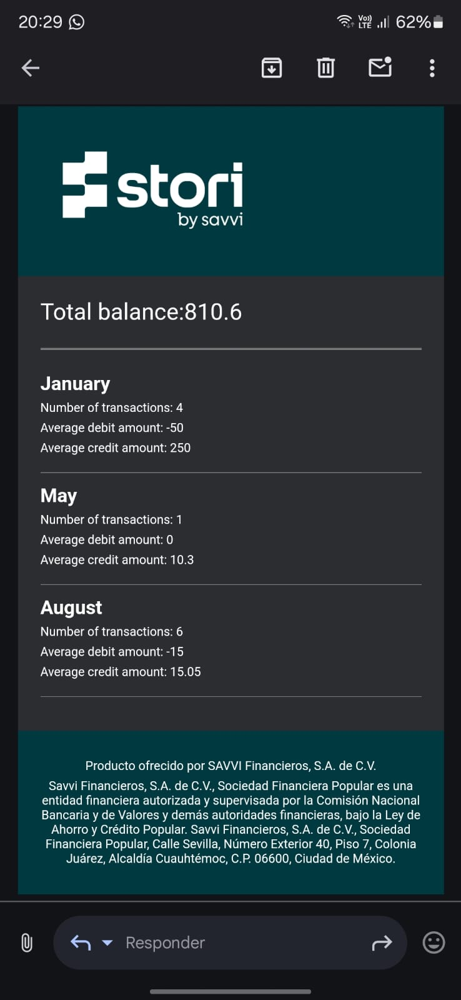

# transactions-processor

Technical challenge for [Stori](https://www.storicard.com/)

## Index
- [Instructions](#instructions)
  - [Introduction](#introduction)
  - [Bonus points](#bonus-points)
  - [Delivery and code requirements](#delivery-and-code-requirements)
- [The solution](#the-solution)
  - [Built With](#built-with)
  - [Architecture](#architecture)
    - [Icons reference](#icons-reference)
    - [Files processing flow](#files-processing-flow)
    - [Update notification email flow](#update-notification-email-flow)
  - [Project structure](#project-structure)
  - [Email examples](#email-examples)
  - [Assumptions](#assumptions)
    - [Average credit and debit amount](#average-credit-and-debit-amount)
    - [Second bonus point: "Save transaction and account info to a database"](#second-bonus-point-save-transaction-and-account-info-to-a-database)
        - [Account](#account)
        - [Transactions IDs](#transactions-ids)
    - [Validations](#validations)
  - [How to run it?](#how-to-run-it)
  - [How to deploy it?](#how-to-deploy-it-using-an-aws-account)
  - [How to destroy it?](#how-to-destroy-it-using-an-aws-account)
- [Tech debt / Next steps](#tech-debt--next-steps)
  - [Unit tests](#unit-tests)
  - [Linter configuration](#linter-configuration)
  - [Docker](#docker)
  - [CI/CD](#cicd)
  - [Local testing](#local-testing)
  - [Tags](#tags)
  - [Refactor infrastructure/infrastructure.go](#refactor-infrastructureinfrastructurego)


## Instructions

### Introduction

For this challenge you must create a system that processes a file from a mounted directory. The file will contain a list of debit and credit transactions on an account. Your function should process the file and send summary information to a user in the form of an email.
An example file is shown below; but create your own file for the challenge.

```csv
Id,Date,Transaction
1,1/1,-150
2,1/3,+900.5
3,1/15,+99.5
4,1/20,-50
5,8/2,-30
6,8/13,-30
7,8/13,-30
8,8/2,+50
9,8/13,+30
10,8/13,+10.3
11,5/13,+10.3

```
Credit transactions are indicated with a plus sign like +60.5. 
Debit transactions are indicated by a minus sign like -20.46

We prefer that you code in Python or Golang; but other languages are ok too. Package your code in one or more Docker images. Include any build or run scripts, Dockerfiles or docker-compose files needed to build and execute your code.

### Bonus points
1. Save transaction and account info to a database
2. Style the email and include Stori’s logo
3. Package and run code on a cloud platform like AWS. Use AWS Lambda and S3 in lieu of Docker.

### Delivery and code requirements
Your project must meet these requirements:
1. The summary email contains information on the total balance in the account, the number of transactions grouped by month, and the average credit and average debit amounts grouped by month. Using the transactions in the image above as an example, the summary info would be

```
Total balance is 39.74
Number of transactions in July: 2
Number of transactions in August: 2
Average debit amount: -15.38
Average credit amount: 35.25

```

2. Include the file you create in CSV format.
3. Code is versioned in a git repository. The README.md file should describe the code interface and instructions on how to execute the code.

## The solution

### Built With

- [Go](https://golang.org/) - Programming Language
- [PostgreSQL](https://www.postgresql.org/) - Object-relational database
- [AWS](https://aws.amazon.com/) - Cloud platform
- [aws-cdk-go](https://pkg.go.dev/github.com/aws/aws-cdk-go/awscdk/v2#section-readme) - AWS Cloud Development Kit Library
- [Mailjet](https://dev.mailjet.com/) - SMTP Server Provider

### Architecture

It's a cloud based solution, so all the resources live in AWS and are created by using the cdk from AWS.

| Service         | Name                     | Description                                                                                   |
|-----------------|--------------------------|-----------------------------------------------------------------------------------------------|
| CloudFormation  | InfrastructureStack      | Infrastructure as code, creates all the AWS resources.                                        |
| S3 Bucket       | transactions-bucket      | A bucket where CSV files with transactions are uploaded.                                      |
| Lambda          | files-processor          | Triggered by the OBJECT_CREATED event in S3, processes CSV files, generates reports, and sends them to reports-queue. |
| Lambda          | email-sender             | Triggered by messages in the reports-queue, generates and sends emails with the report data.  |
| Lambda          | ssm-params-updater       | Triggered by a PUT endpoint, updates the notification-email parameter in SSM.                 |
| SQS Queue       | reports-queue            | Receives messages from the files-processor Lambda after processing the CSV files.             |
| API Gateway     | ssm-params-api           | Exposes a REST API with a PUT endpoint to update an SSM parameter.                            |
| Secrets Manager | Database configuration   | Stores the database configuration used by the files-processor Lambda.                         |
| VPC             | auto generated by aws    | VPC with public subnet used by the RDS.                                                       |
| RDS             | transactionsProcessorDB  | RDS instance that holds a PostgreSQL database where the transactions are stored.              |
| SSM Parameters  | different parameter      | Stores API keys and sender email for the SMTP provider, also the notification email where the report is sent. |

#### Icons reference

Representation of each component involved.



#### Files processing flow



1. A csv file with transactions is uploaded to the S3 bucket called transactions-bucket
2. The files-processor Lambda:
    2.1 Is triggered by the OBJECT_CREATED event, every time an object is uploaded to the S3
    2.2 Gets the csv file from the bucket
    2.3 Process the csv and generates a Report (With the required information)
    2.3 Gets the Database configuration from the secret stored in AWS Secrets Manager
    2.4 Inserts the transaction to the database
    2.5 Sends a message to the reports queue
3. The email-sender Lambda:
    2.1 Is triggered thanks to the sqs event source that connects it to the reports-queue. (Every time a new message is sent to the reports-queue)
    2.2 Generates the email content using a styled HTML template
    2.3 Gets the SMTP provider data from the SSM Params (API keys, sender email) and the notification-email (where the reports are sent)
    2.4 Sends the email

#### Update notification email flow



1. A PUT endpoint of /params is hit
2. The ssm-params-updater Lambda is triggered
3. That lambda updates the param for the notification-email 


### Project structure

```
/                   Contains common files, like Makefile, the README, LICENSE, go mod and sum, the cdj.json and the gitignore
/db
    /migrations:    Contains database migration scripts.
/infrastructure:    Contains the Infrastructure as Code project to create all the AWS resources 
/internal:          Contains the business logic code.
    /lambda:        Contains a folder for each lambda. Each lambda has it's main.go entry point with the handler.
        /email-sender
        /files-processor
        /ssm-params-updater
    /models:        Contains the models of the database tables
    /repository:    Contains the functions related to the database
    /services:      Contains functions that consume external services, such us AWS or MailJet.
        /s3:            AWS S3 buckets functions
        /secrets:       AWS Secrets Manager functions
        /sqs:           AWS SQS queues functions
        /ssm:           AWS Systems Manager Parameter Store functions
    /types:         Contains the types used in /internal
    /utils:         Contains functions that do not consume external services. Also known as helpers.
        /logger:    Contains function abstract from the logging library
        /templates: Contains the html template used for the email content
/files:             Contains the example transactions file.
/docs:              Contains files related to the documentation.


- files Contains file storage.
- docs Contains project documentation.
- infrastructure Contains infrastructure-related code and configurations.
```

### Email examples

#### Computer




#### Phone




### Assumptions

#### Average credit and debit amount

It's assumed that the amounts are required to be grouped by month.

#### Second bonus point: "Save transaction and account info to a database"

##### Account

To limit scope it's assumed that all the transactions are related to the same account, no matter what notification email is being used. That's why the account is being inserted during the migration, and the account_id hardcoded when the transactions are inserted. In a real world scenario we would have also a Users table related to the Account.

##### Transactions IDs

Since having auto incremented IDs in a database is not a good practice, It's assumed that the IDs of the transactions file are just for that file. For the database an UUID is generated, so we can't relation the transactions in the file to the transactions in the database.

#### Validations

It's assumed that the input csv file will always have the same format as it's shown in the instructions.
It's also assumed that the notification email stored in the ssm param respects the email format.


### How to run it?

It can be tested using the already deployed resources in AWS. Step by step guide:

1. Update the email where you want to receive the report

```
make update-email email=rodrigoenzohernandez@gmail.com
```

2. Upload a csv file with transactions to the public S3 bucket. (You need to have configured your AWS cli with real credentials)

```
make run-dev
```


### How to deploy it using an AWS Account?

1. Export required OS variables. This variables are used to create the SSM params.
```
export SMTP_PROVIDER_PUBLIC_KEY=<insert-your-mailjet-public-key>
export SMTP_PROVIDER_PRIVATE_KEY=<insert-your-mailjet-private-key>
export SMTP_PROVIDER_SENDER=<insert-the-email-used-to-create-your-mailjet-account>
export SMTP_NOTIFICATION_EMAIL=<insert-the-email-where-the-report-will-be-sent>
```

2. Execute this command from the Makefile

```
make deploy
```

It builds all the lambdas, deploys the infrastructure and runs the up migrations.


### How to destroy it using an AWS Account?

If you want to remove all the generated resources from the AWS account, run:

```
make destroy
```

## Tech debt / Next steps

Due to a matter of time or scope, this solution has well known limitations that can be handled in a real world scenario.

### Unit tests

Unit test must have to be written to accomplish at least 80% of code coverage.

### Linter configuration

A linter configuration must have to be added to maintain the code style and good practices along all the repos in the organization.

### Docker

- Instead of building the lambdas with a script in the Makefile, a Docker Image with Docker compose can be implemented. Also the cdk deploy can be improved by creating a Docker compose script.

### CI/CD

A pipeline to run the tests, build and deploy must be created. The pipeline should:
    - Deploy to dev environment when a PR is merged to develop branch
    - Deploy to QA environment when a release branch is created
    - Deploy to PROD environment when a PR is merged to main branch


### Local testing

For now the solution can only be tested by consuming que deployed version. A docker image with docker compose can be prepared to test the solution locally or [LocalStack](https://docs.localstack.cloud/user-guide/integrations/sdks/go/) may be a good option too.

### Tags

This is not deployed in production, so when it is, a tag with following the [Semantic Versioning](https://semver.org/) must be created.

### Refactor infrastructure/infrastructure.go

This file can be refactored to be divided into 4 different stacks, Storage, Network, Configuration, Lambda

